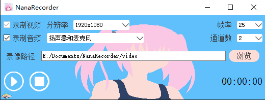

[English version](./README_en.md)

# 基于Qt+FFmpeg的录屏软件NanaRecorder

## UI


## 录制流程
  

主线程：UI线程，调用Recorder接口  
采集线程：采集到帧后->格式转换/重采样->写进FIFO  
编码复用线程：循环从FIFO读取帧->编码->写进文件

## 环境依赖
### windows
VS：推荐VS2017以后的版本  
Qt：推荐Qt5.12以后的版本  
FFmpeg5.1（项目已包含，生成项目后dll会自动拷贝到exe目录）

我的开发环境
- VS2022
- Qt5.12.9 
  
解决方案支持Debug/Release和Win32/x64  
</br>
[VS+Qt开发环境配置](./doc/VS%2BQt%E5%BC%80%E5%8F%91%E7%8E%AF%E5%A2%83.pdf)

### linux
我的开发环境
- Qt6.2.4
- FFmpeg5.1.2

<font color=red>注意：</font>
目前linux下录音用到了PulseAudio，ffmpeg默认是不支持PulseAudio的，所以要手动编译ffmpeg，`./configure`时添加`--enable-libpulse`，具体编译参考如下文档  
[ffmpeg build reference](./doc/ffmpeg_build.md)

需要在CMakeLists.txt里修改Qt和FFmpeg的依赖路径
- QT_PATH
- FFMPEG_ROOT_DIR（你编译的ffmpeg根目录）

#### 构建
```cpp
mkdir build && cd build
cmake ..
make -j4
```

#### 运行app
1. 直接用Qt Creator运行  
2. 命令行启动：`../bin/NanaRecorder`  

## TODO
- [ ] 画质高，文件小，码率低  
- [ ] flush编码器  
- [X] 支持同时录制扬声器和麦克风  
- [ ] 支持硬编码
