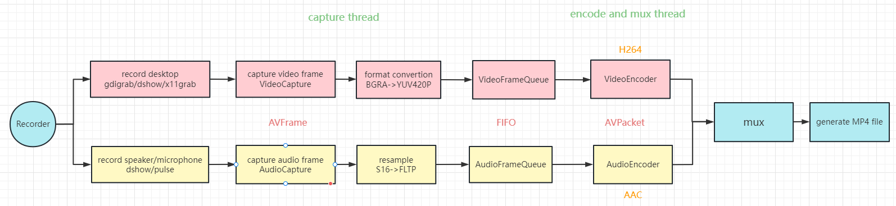

# NanaRecorder - A screen recorder based on Qt and FFmpeg

## UI


## Flowchart
  

Main thread：UI thread，call Recorder interface  
Capture thread：capture frame->format convertion/resample->write into FIFO  
Encode and mux thread：read frame from FIFO->encode->mux to file

## Dependencies
### Windows
VS：VS2017 and later are recommended  
Qt：Qt5.12 and later are recommended  
FFmpeg5.1 (Included in project，DLL will copy to exe directory after VS Build)

My development environment
- VS2022
- Qt5.12.9 
  
The solotuion support Debug/Release and Win32/x64  
</br>
[VS+Qt开发环境配置](./doc/VS%2BQt%E5%BC%80%E5%8F%91%E7%8E%AF%E5%A2%83.pdf)

### Linux
My development environment
- Qt6.2.4
- FFmpeg5.1.2

[ffmpeg build reference](./doc/ffmpeg_build.md)

You need to modify Qt and FFmpeg dependencies path in CMakeLists.txt
- QT_PATH
- FFMPEG_ROOT_DIR

#### Build
```shell
mkdir build && cd build
cmake ..
make -j4
```

#### Run app
1. Run directly in Qt Creator  
2. Run in shell：`../bin/NanaRecorder`  

## TODO
- [ ] Flush encoder  
- [ ] Record simultaneously both speaker and mircophone  
- [ ] Support hardware acceleration  
- [ ] High picture quality, samll file size and low bit rate  
